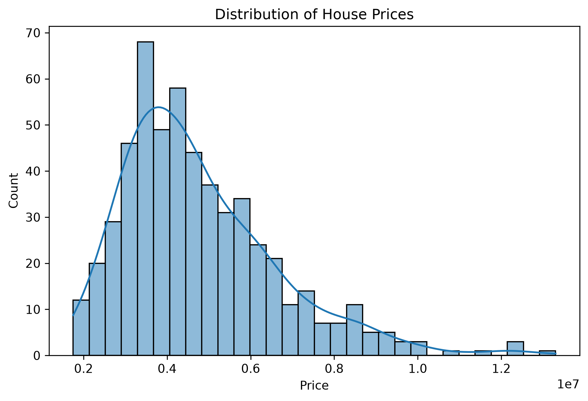
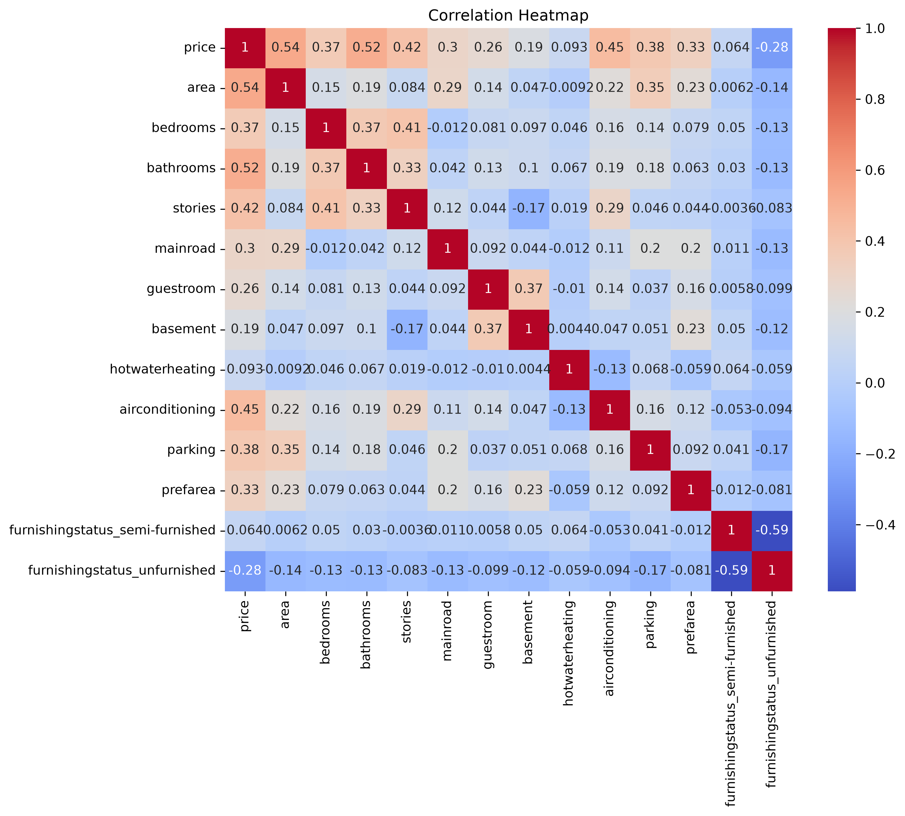
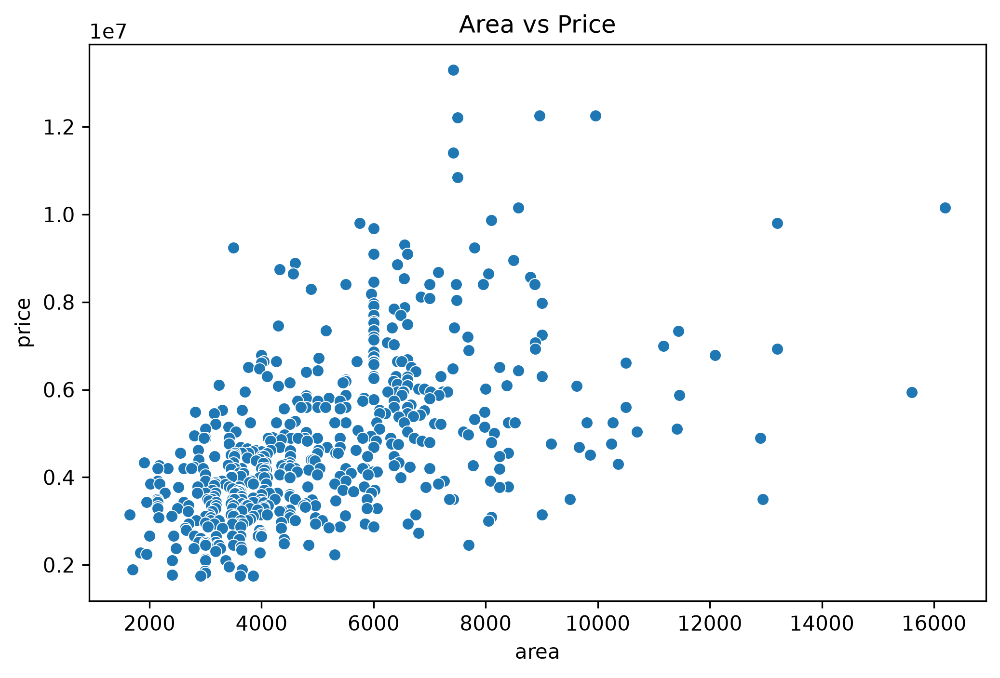
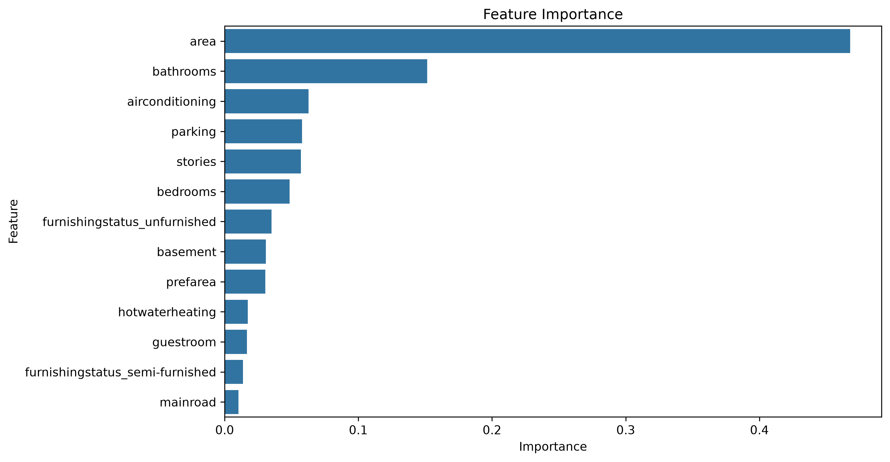
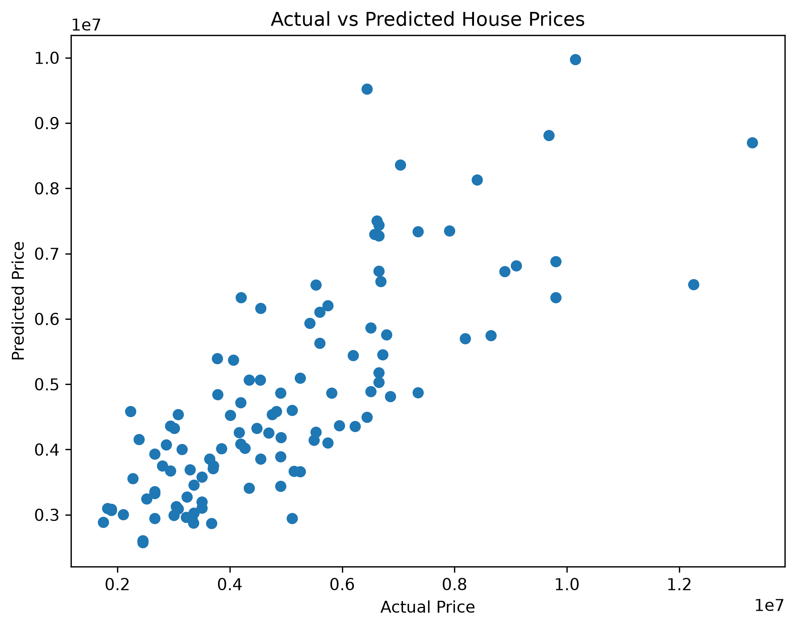

# 🏠 House Price Prediction using Machine Learning

An end-to-end Machine Learning project that predicts house prices based on various housing features. This project demonstrates the complete ML workflow, including data preprocessing, exploratory data analysis, model building, evaluation, and model deployment preparation.

---

## 📌 Project Overview

House price prediction is a regression problem where the objective is to estimate the selling price of a house based on its characteristics.

In this project, multiple Machine Learning models were trained and compared to identify the best-performing model.

---

## 🎯 Objectives

- Perform Exploratory Data Analysis (EDA)
- Clean and preprocess the dataset
- Encode categorical variables
- Train multiple regression models
- Compare model performance
- Analyze feature importance
- Save the trained model for future use

---

## 📂 Dataset

- Housing Price Dataset
- Total Records: **545**
- Features: **13**
- Target Variable: **Price**

---

## 🛠️ Technologies Used

- Python
- Pandas
- NumPy
- Matplotlib
- Seaborn
- Scikit-learn
- Joblib
- Jupyter Notebook

---

## 📊 Exploratory Data Analysis

Performed:

- Dataset inspection
- Statistical summary
- Missing value analysis
- Duplicate value check
- Correlation heatmap
- Distribution plots
- Scatter plots
- Box plots

---

## 🤖 Machine Learning Models

- Linear Regression
- Decision Tree Regressor
- Random Forest Regressor

---

## 📈 Model Evaluation

Evaluation Metrics:

- Mean Absolute Error (MAE)
- Mean Squared Error (MSE)
- Root Mean Squared Error (RMSE)
- R² Score

Random Forest achieved the best overall performance among the trained models.

---

## 📷 Project Visualizations

### Distribution of House Prices



---

### Correlation Heatmap



---

### Area vs Price



---

### Feature Importance



---

### Actual vs Predicted Prices



---

## 📁 Project Structure

```
house-price-prediction/
│
├── data/
├── images/
├── model/
├── notebook/
├── requirements.txt
├── README.md
└── .gitignore
```

---

## 🚀 Future Improvements

- Hyperparameter tuning
- Cross-validation
- Feature engineering
- Streamlit web application
- Model deployment using Flask/FastAPI

---

## 📬 Connect With Me

**GitHub**
https://github.com/varsha517

**LinkedIn**
https://linkedin.com/in/s-varsha-a904092b5

---

⭐ If you found this project useful, consider giving it a Star!
